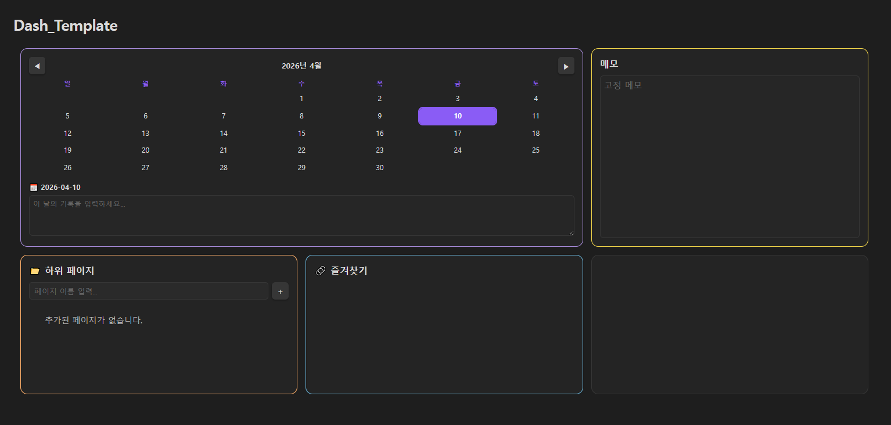

# my_obsidian

개인용 기본 Obsidian 볼트 템플릿입니다.

---

## 미리보기

---

## content

Dataview 플러그인 기반의 대시보드 하나가 전부입니다.

그리드 형태로 구성되어 있고, 각 칸에는 이런 것들이 있어요:

- **캘린더** — 날짜를 클릭하면 그날의 기록을 남길 수 있어요. 기록이 있는 날은 점으로 표시됩니다.
- **메모** — 고정 메모장입니다. 타이핑하면 알아서 저장됩니다.
- **하위 페이지** — 이름을 입력하면 `Dash/하위페이지/` 경로에 md 파일이 자동 생성되고 목록에 추가됩니다.
- **즐겨찾기** — 자주 쓰는 링크를 코드에 직접 넣어두는 방식입니다.

저장 버튼 같은 건 없고 전부 자동저장입니다 (localStorage 기반).

---

## 사용법

1. `Templates/Dash_Template.md` 파일을 원하는 위치에 복사
2. 파일 상단의 `STORAGE_KEY_*` 값을 고유한 이름으로 변경 (여러 대시보드를 쓸 경우 데이터가 섞이지 않게)
3. `bookmarks` 배열에 원하는 링크 추가

---

## 필요한 플러그인

- [Dataview](https://github.com/blacksmithgu/obsidian-dataview)
